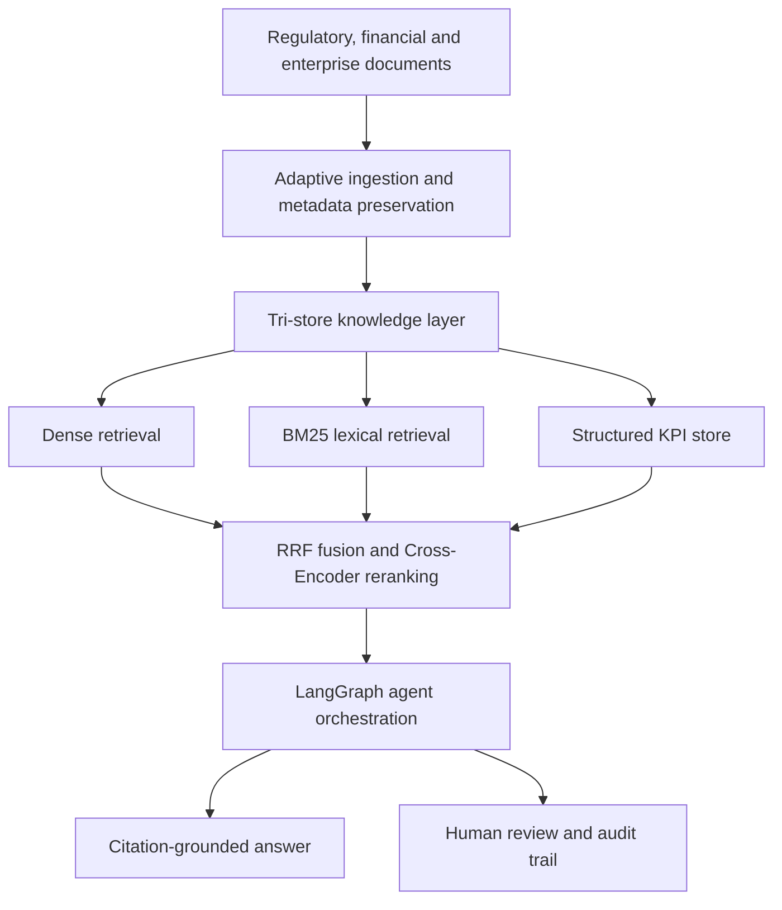

<div align="center">


[](https://git.io/typing-svg)

<br>

[](https://pict.edu/)


[](https://www.google.com/maps/place/Pune,+Maharashtra)


<br><br>

[](https://github.com/VedantKarne?tab=repositories)
[](https://www.linkedin.com/in/vedant-karne-31023b302/)
[](https://medium.com/@vedantkarne15)
[](mailto:vedantkarne15@gmail.com)

<br><br>


[](https://github.com/VedantKarne?tab=followers)
[](https://github.com/VedantKarne?tab=repositories)
[](https://leetcode.com/u/Vedant_Karne_2/)

</div>

---

<div align="center">
<sub><code>// 01 · CORE_IDENTITY</code></sub>
<h2>About & Engineering Mindset</h2>
</div>

```console
vedant@pict:~$ ./profile --status

ROLE          Software Engineer · AI/ML Engineer · Product Builder
EDUCATION     B.Tech Computer Engineering (AI/ML) @ PICT Pune
MISSION       Research-grade intelligence → reliable software products
PRINCIPLES    Systems thinking · measurable impact · auditable decisions
```

I am a **Computer Engineering undergraduate at Pune Institute of Computer Technology**, specializing in **AI/ML** and engineering products across intelligent systems, backend infrastructure, and full-stack development.

My work spans **agentic RAG platforms, retrieval engineering, production-oriented ML pipelines, document intelligence, real-time APIs, and interactive software products**. I approach every system with the same discipline: identify the real constraint, design clean boundaries, expose observability, validate under realistic conditions, and ship an experience people can trust.

Across finance, regulatory intelligence, healthcare, credit risk, fraud detection, and algorithm visualization, I focus on converting promising models into **reliable, explainable, auditable, and measurable systems**.

> [!IMPORTANT]
> **Open to 2026 Software Engineering, AI/ML Engineering, Backend Engineering, and Applied AI internships**, along with open-source collaborations and high-impact product teams.

---

<div align="center">
<sub><code>// 02 · ENGINEERING_TOOLKIT</code></sub>
<h2>Tech Stack</h2>
</div>

<div align="center">

### Languages

[](https://skillicons.dev)

### Frontend & Desktop

[](https://skillicons.dev)

### Backend & Databases

[](https://skillicons.dev)

### DevOps & Tooling

[](https://skillicons.dev)

</div>

| Engineering Layer | Core Technologies |
| :--- | :--- |
| **Agentic Systems** | LangGraph, LangChain, multi-agent routing, Human-in-the-Loop, structured outputs |
| **Retrieval** | ChromaDB, BM25, dense embeddings, RRF, Cross-Encoder reranking, RAPTOR, BGE-M3 |
| **ML & Modeling** | XGBoost, LightGBM, CatBoost, TabNet, Optuna, SHAP, ensemble learning |
| **Document AI** | PyMuPDF, Docling, OCR fallback, adaptive PDF routing, metadata-aware chunking |
| **Engineering Practice** | API-first architecture, system design, testing, debugging, Docker, Git workflows |

---

<div align="center">
<sub><code>// 03 · INTELLIGENCE_LAYER</code></sub>
<h2>AI / ML Expertise</h2>
</div>

| Domain | Level | Production Focus |
| :--- | :---: | :--- |
| **Agentic AI & RAG** | `ADVANCED` | LangGraph DAGs, intelligent routing, HITL approval, typed outputs, execution observability |
| **Retrieval Engineering** | `ADVANCED` | Dense + lexical fusion, RRF, reranking, entity-aware retrieval, RAPTOR trees |
| **Machine Learning** | `ADVANCED` | Gradient boosting, ensemble design, temporal validation, feature engineering |
| **Model Optimization** | `ADVANCED` | Bayesian optimization, threshold calibration, leakage detection, error analysis |
| **Explainable & Fair AI** | `ADVANCED` | SHAP, demographic fairness checks, citation grounding, auditable decisions |
| **Document Intelligence** | `PROFICIENT` | Parser routing, OCR fallback, metadata preservation, hierarchical indexing |
| **ML Platform Engineering** | `PROFICIENT` | FastAPI inference, Pydantic contracts, Dockerized services, real-time integration |

### Multi-Agent Retrieval Architecture



<div align="center">

[](https://github.com/VedantKarne)

</div>

---

<div align="center">
<sub><code>// 04 · ENGINEERING_PORTFOLIO</code></sub>
<h2>Featured Systems & Projects</h2>
<p><code>Click a system to inspect its architecture, scale, performance, and impact.</code></p>
</div>

<details open>
<summary><b>AURA — Agentic Financial Intelligence Platform</b> &nbsp; <code>FINANCIAL RAG</code></summary>

<br>


An enterprise-oriented platform that turns multi-company earnings material into source-grounded analysis, investment briefings, and KPI views through observable agent workflows.

| Dimension | System Detail |
| :--- | :--- |
| **Stack** | Python, FastAPI, LangGraph, LangChain, React Flow, SSE, SQLite, ChromaDB, BM25, Docker |
| **Architecture** | Tri-store retrieval: deterministic KPI store + semantic vector store + lexical index |
| **Performance** | RRF and Cross-Encoder reranking improve relevance and reduce entity starvation |
| **Reliability** | Citation traceability, structured routing, provenance preservation, grounded synthesis |
| **Impact** | Converts fragmented earnings information into auditable financial intelligence |
| **Repository** | [VedantKarne/AURA-Financial-Intelligence](https://github.com/VedantKarne/AURA-Financial-Intelligence) |

The system exposes each routing, retrieval, and synthesis stage through live execution traces. This makes the agent graph inspectable instead of presenting an opaque single-prompt interface.

</details>

<details>
<summary><b>Nirmaan AI — Agentic DRHP Intelligence Platform</b> &nbsp; <code>SEBI PS-04</code></summary>

<br>


A regulatory intelligence platform for the National SEBI Hackathon, engineered to accelerate SME IPO offer-document preparation from source ingestion through merchant-banker review.

| Dimension | System Detail |
| :--- | :--- |
| **Stack** | Python, FastAPI, LangGraph, PostgreSQL, ChromaDB, Docling, PyMuPDF, OCR, Pydantic |
| **Scale** | SEBI regulations, DRHPs, MCA filings, issuer documents, and hierarchical indexes |
| **Performance** | Adaptive parser routing, OCR fallback, metadata-aware chunking, hybrid retrieval, reranking |
| **Reliability** | HITL checkpoints, typed response contracts, citations, provenance, auditable generation |
| **Impact** | Targets the time, cost, and compliance burden of SME IPO DRHP preparation |
| **Repository** | [VedantKarne/SME-IPO-DRHP-Generator](https://github.com/VedantKarne/SME-IPO-DRHP-Generator) |

Nirmaan treats regulatory drafting as a controlled workflow rather than free-form generation. Every high-stakes output remains connected to its evidence and review path.

</details>

<details>
<summary><b>CredX — Fair Credit Scoring Platform</b> &nbsp; <code>1ST PLACE · ALCISTA '25</code></summary>

<br>


An AI-powered credit assessment system built for ALCISTA: HackTheBank, where I led end-to-end ML engineering for Team MoneyHeist's first-place solution.

| Dimension | System Detail |
| :--- | :--- |
| **Stack** | Python, ensemble ML, feature engineering, fairness analysis, real-time inference |
| **Scale** | Credit-risk assessment across behavioral, financial, gender, and regional signals |
| **Performance** | Improved ROC-AUC from **68% to 93.54%** with decisions delivered in **under 2 seconds** |
| **Reliability** | Chronological validation, leakage controls, and fairness checks across demographic groups |
| **Impact** | **1st Place**, ALCISTA '25 HackTheBank — Seniors Category |
| **Case Study** | [How I Built Fair AI That Reached 93.54% AUC](https://medium.com/@vedantkarne15/-704f3c7e7549) |

The decisive engineering work was not simply choosing a stronger model. I found and eliminated leakage, rebuilt the evaluation strategy, optimized the ensemble, and validated predictive strength alongside demographic fairness.

</details>

<details>
<summary><b>Sentinel AI — Emergency Triage & Hospital Routing</b> &nbsp; <code>TOP 77 / ~600</code></summary>

<br>


A golden-hour emergency platform combining patient triage, capability-aware hospital routing, and real-time operational interfaces.

| Dimension | System Detail |
| :--- | :--- |
| **Stack** | XGBoost, LightGBM, FastAPI, React, Node.js, WebSockets, MapLibre GL, Three.js, OSRM |
| **Scale** | Eight-class diagnosis pipeline, 18 hospitals, multiple care tiers, equipment and bed constraints |
| **Performance** | Soft-vote triage, constraint ranking, real-road routing, live dispatch synchronization |
| **Reliability** | Hard capability filters, explainable decisions, bounded reservations, resource validation |
| **Impact** | Top 77 of approximately 600 teams at the Ignisia National AI Hackathon |
| **Repository** | [AkshatPatil101/Eternum_HC03](https://github.com/AkshatPatil101/Eternum_HC03) |

Sentinel routes an ambulance to a hospital that can actually treat the patient—not merely the geographically nearest facility.

</details>

<details>
<summary><b>Fraud Guard — Cascaded Fraud & Risk Pipeline</b> &nbsp; <code>TECHFIESTA 2026</code></summary>

<br>


A cascaded fraud-detection platform combining deterministic risk controls with probabilistic models for ambiguous gray-zone transactions.

| Dimension | System Detail |
| :--- | :--- |
| **Stack** | FastAPI, Bayesian Neural Network, XGBoost, LightGBM, CatBoost, Optuna, React |
| **Scale** | 30 expert rules, 9 tiers, 235 features, 22,500 unseen chronological test transactions |
| **Performance** | Leakage-corrected **89.0% ROC-AUC** with optimized ensemble weights and thresholds |
| **Reliability** | Tiered filtering, calibrated gray-zone review, leakage-aware evaluation, explainable signals |
| **Impact** | Replaced an inflated 98.8% score with a realistic production-oriented validation framework |
| **Repository** | [AkshatPatil101/Fraud-Guard](https://github.com/AkshatPatil101/Fraud-Guard) |

The pipeline resolves clear cases through deterministic rules, routes ambiguity through a Bayesian model, and combines the remaining signals with a tuned gradient-boosting ensemble.

</details>

<details>
<summary><b>RouteRush Island — Gamified Pathfinding Simulator</b> &nbsp; <code>CROSS-PLATFORM</code></summary>

<br>


A desktop experience that transforms shortest-path algorithms from static console output into an interactive tropical-island simulation.

| Dimension | System Detail |
| :--- | :--- |
| **Stack** | Electron, JavaScript, HTML, CSS, graph algorithms, cross-platform packaging |
| **Scale** | Dijkstra, Bidirectional Dijkstra, Bellman-Ford, BMSSP-inspired simulation |
| **Performance** | Live execution visualization, comparative metrics, traffic, obstacles, dynamic rerouting |
| **Reliability** | Local-first execution with no required cloud credentials or personal-data pipeline |
| **Impact** | Converts abstract DSA concepts into a visual, explorable learning product |
| **Repository** | [VedantKarne/routerush-island](https://github.com/VedantKarne/routerush-island) |

RouteRush evolved from a C++ academic exercise into a polished learning product distributed across Windows, macOS, and Linux.

</details>

---

<div align="center">
<sub><code>// 05 · LEADERSHIP_LOG</code></sub>
<h2>Experience</h2>
</div>

### Student Member — PICT CSI Student Branch

`OCT 2024 → PRESENT` · **Pune Institute of Computer Technology**

- Co-organize technical workshops and student outreach initiatives.
- Collaborate across technical and operational teams to deliver computing events.
- Support knowledge-sharing programs that make engineering concepts accessible.


### Class Representative — First Year Computer Engineering

`OCT 2024 → FEB 2025` · **Pune Institute of Computer Technology**

- Coordinated academic communication between students, faculty, and the department.
- Consolidated cohort feedback and resolved information gaps around academic milestones.
- Built practical stakeholder communication, leadership, and issue-resolution experience.


### ML Engineer & Architecture Lead — Competition Teams

`2025 → PRESENT` · **MoneyHeist · Eternum · Anomaly.exe**

- Led ML strategy across fintech, emergency response, and fraud-detection hackathon systems.
- Eliminated data leakage, designed fair evaluation, and integrated real-time inference APIs.
- Translated model performance into complete end-to-end product experiences.


---

<div align="center">
<sub><code>// 06 · RECOGNITION_INDEX</code></sub>
<h2>Achievements</h2>
</div>

| Recognition | Verified Detail |
| :--- | :--- |
| **ALCISTA '25 HackTheBank** | **1st Place**, Seniors Category — Team MoneyHeist, CredX fair-credit platform |
| **NPTEL Gold Medallist** | Top **2% nationally** — Fundamental Algorithms, Design and Analysis |
| **Machine Learning Specialization** | **100% score** — Andrew Ng, DeepLearning.AI / Stanford via Coursera |
| **Ignisia National AI Hackathon** | Top **77 of approximately 600 teams** in a national 24-hour build |
| **Competitive Programming** | 5-Star C++, 5-Star Java, 4-Star Python on HackerRank; **400+ LeetCode** problems |
| **MHT-CET** | **99.6735 percentile**, AIR 812 |
| **JEE Main** | **96.9662 percentile** |

---

<div align="center">
<sub><code>// 07 · VERIFIED_CREDENTIALS</code></sub>
<h2>Certifications</h2>
</div>

### NPTEL

[](https://nptel.ac.in/)
[](https://nptel.ac.in/)

### DeepLearning.AI · Stanford · Coursera

[](https://www.coursera.org/specializations/machine-learning-introduction)

### Pune Institute of Computer Technology

[](https://pict.edu/)
[](https://www.linkedin.com/in/vedant-karne-31023b302/)

---

<div align="center">
<sub><code>// 08 · PROBLEM_SOLVING</code></sub>
<h2>Coding Profiles</h2>

[](https://leetcode.com/u/Vedant_Karne_2/)
[](https://www.hackerrank.com/)
[](https://www.geeksforgeeks.org/)
[](https://www.codechef.com/)

</div>

---

<div align="center">
<sub><code>// 09 · LIVE_TELEMETRY</code></sub>
<h2>GitHub Analytics</h2>


<br>


<br>


</div>

---

<div align="center">
<sub><code>// 10 · TROPHY_CABINET</code></sub>
<h2>GitHub Trophies</h2>

[](https://github.com/ryo-ma/github-profile-trophy)

</div>

---

<div align="center">
<sub><code>// 11 · CONTRIBUTION_SIGNAL</code></sub>
<h2>Contribution Activity</h2>

[](https://github.com/VedantKarne)

</div>

---

<div align="center">
<sub><code>// 12 · COMMIT_STREAM</code></sub>
<h2>Contribution Snake</h2>


</div>

---

<div align="center">
<sub><code>// 13 · ACTIVE_PROCESSES</code></sub>
<h2>Current Focus</h2>
</div>

```yaml
Learning:
  - Advanced data structures and algorithms
  - Scalable system design and backend architecture
  - Production evaluation for agentic AI systems

Building:
  - Nirmaan AI: regulatory intelligence for SME IPO workflows
  - AURA: multi-agent financial earnings intelligence
  - Reliable full-stack products around ML and retrieval systems

Exploring:
  - Trustworthy RAG and retrieval-quality evaluation
  - Explainable, fair, and leakage-resistant machine learning
  - Human-in-the-Loop workflows for high-stakes AI

Open_To:
  - Software Engineering internships
  - AI/ML and Applied AI internships
  - Open-source collaboration
  - High-impact engineering and research projects
```

---

<div align="center">
<sub><code>// 14 · ESTABLISH_CONNECTION</code></sub>
<h2>Let's Build Intelligent Software</h2>

I am actively seeking engineering roles, open-source collaborations, and ambitious teams building dependable software around AI.

<br>

[](mailto:vedantkarne15@gmail.com)
[](https://www.linkedin.com/in/vedant-karne-31023b302/)
[](https://github.com/VedantKarne)
[](https://medium.com/@vedantkarne15)

<br><br>

<code>"Architecture is the difference between a model in a notebook and a system in production."</code>


</div>
